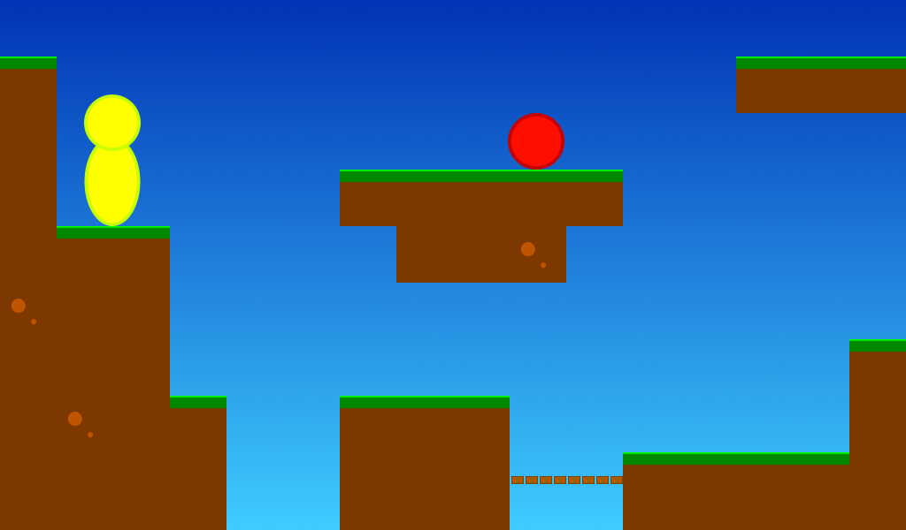

# Introduction

This is the Super Platformer - a Godot game made by me and my kids.

# Todo

I want to get the following done (in no particular order):

- There should be an android soft joystick overlay
- There should be treasures
- There should be coloured keys
- The player should be animated
- The enimies should be animated
- Multiple levels, menues, points and such
- The camera should stay relevant after player death
- There should be non-stompable enemies
